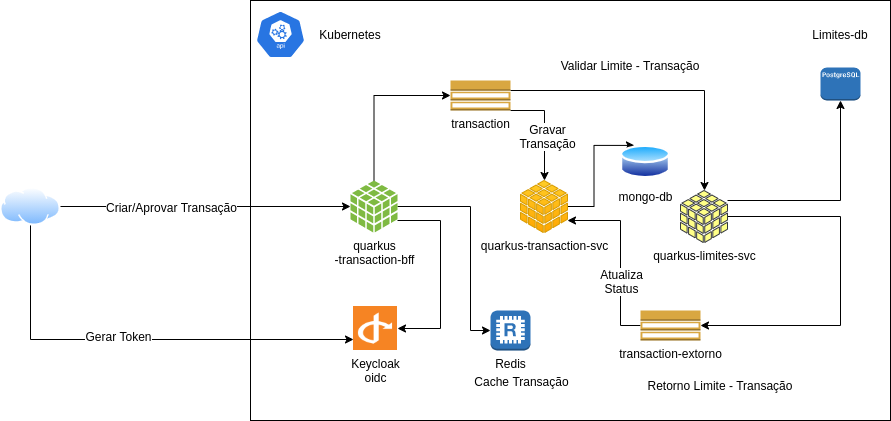

## BFF para proxy de Transações Financeiras.

Para subir local a aplicação executem no terminal ./mvnw compile quarkus:dev

./mvnw quarkus:add-extension -Dextensions="rest-client,rest-client-jackson"

Execução

1) ./mvnw compile quarkus:dev
2) Subir localmente kafka, redis e zipkin
   Executar: docker-compose -f docker-compose-kafka-zipkin.yml up

## Desenho

### Gerar imagem nativa.

export GRAALVM_HOME=/home/cleber/programs/graalvm-ce-java11-21.2.0
./mvnw package -Pnative -Dquarkus.native.container-build=true

### Gerar imagem nativa com Docker.

./mvnw quarkus:add-extension -Dextensions="container-image-docker"
./mvnw clean package -Dquarkus.container-image.build=true -Dquarkus.container-image.push=true

### Gerar descritor Kubernetes

./mvnw quarkus:add-extension -Dextensions="kubernetes,jib"

